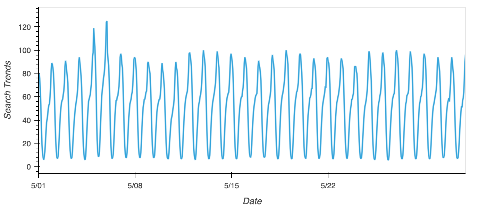
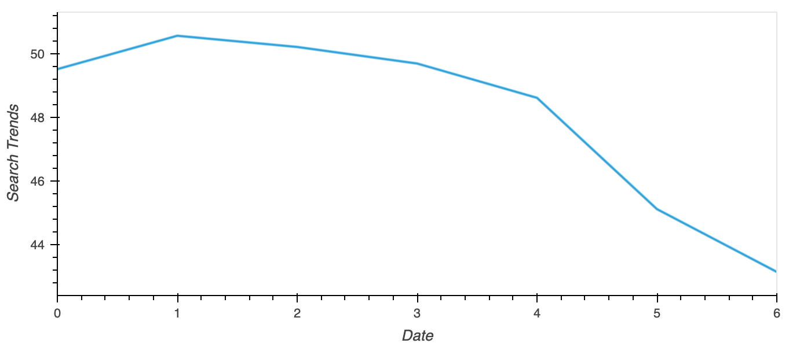
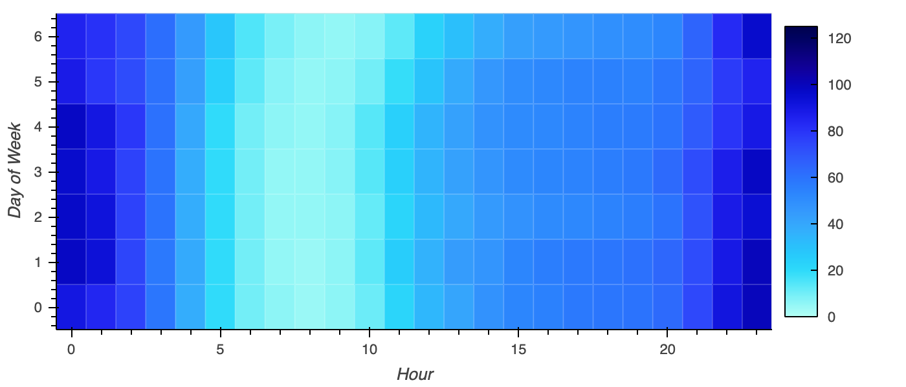
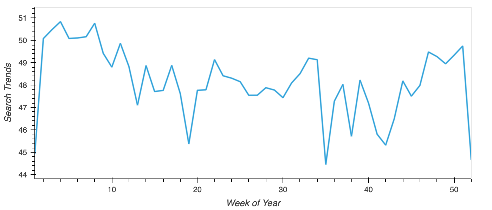
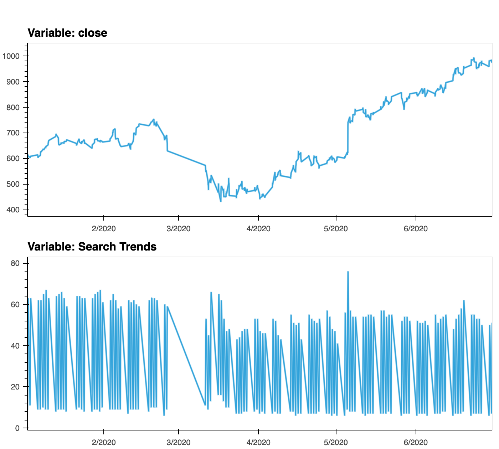

# **Module_11_Challenge**

## **TimeSeries Analysis**

The initial challenge is to identify Unusual Patterns in Hourly Google Search Traffic trends of MercadoLibre, Latin America's most popular e-commerce site.

### **Exploratory Data Analysis**

The Huge amount of Hourly Data required usage of Google Colab platform to run our analysis. After the initial upload and extraction of MercadoLibre's historical Google Search Trends as a DataFrame for exploratory analysis, the DataFrame's index is extracted in DateTime format to ease the timeseries analysis of the search trends.

The Data is then sliced into various time frames especially the month of May 2020 when MercadoLibre released its quarterly financial results. The outcome was an identifiable pattern wherein the search trends varied with time especially around major events pertaining to MercadoLibre in particular and general events like COVID-19 Pandemic.

The Search trends during the week sees a specific pattern wherein the search rate is higher during the start of the week and dipping down drastically over the weekends.

A simillar trend is obeserved during a day as well where in there is higher search traffic during early mornings and late evenings with almost negligible traffic during the mornings from 5 AM to 11 AM, with increasing traffic as the day passes.

Further, From the visualization, with a low mean of 45 around week 42, the search traffic tends to increase during the winter holiday period increasing to a mean of 49.7 during 51st week.

### **Impact of Google Search Trends on MercadoLibre's Stock Performance**

The influence of timing of MercadoLibre's financial reporting on Google serach trends raised a curiousty whether the search trends can be correlated with the company's stock price movement.

Looking at both the search trend timeseries and the stock price timeseries indicate a common trend wherein after the initial shock to global financial markets owing to COVID-19, new customers and revenue increased for e-commerce platforms.

To better understand the correlation, a correlation matrix is plotted for lagged search trends, stock volatility and price movement. The outcome was not conclusive on th expected lines, with correlations close to zero, the data doesn't point to any strong predictable relationship between the lagged search traffic and the stock volatility or between the lagged search traffic and the stock price returns. 

However, it does point to the direction of stock volatility and price returns movement with changes in search trends as there is a negative and positive correlation for lagged search trends with stock volatility and price returns respectively.

### **Facebook Prophet to project Search Trends and Revenue over the quarter**

Using Prophet function, the search trends were projected for next 2000 hours and the revenue for next quarter to understand the pattern. While a declining search trend was projected taking cue from the recent historical trends, the quarterly sales is most likely to be 969.61 Million USD with a upper and lower bounds of 1051.13 Million USD and 887.43 Million USD at a confidence level of 95%.

